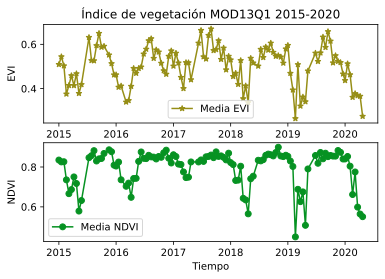

#### Series de Tiempo (EVI y NDVI)
**Autor:** Javier Martínez

**Tutor:** Isabel LLatas

Los datos [*MODIS/006/MOD13Q1*](https://developers.google.com/earth-engine/datasets/catalog/MODIS_006_MOD13Q1) del catálogo GEE corresponden al producto *MOD13Q1.v006* de la NASA. Este proporciona un valor de índice de vegetación por píxel para el EVI y NDVI. Vale destacar que el algoritmo diseñado por la *NASA* elige el mejor valor del píxel disponible, de todas las adquisiciones, en un periodo de 16 días a una resolución espacial de 250 metros.

Vale destacar que en la banda *SummaryQA* del producto  *MODIS/006/MOD13Q1* se muestran los valores pertinentes a la calidad los cuales son de utilidad para realizar filtros según las necesidades del estudio. También es importabnte señalar que se debe tener en cuenta el *factor de escala* de 0.0001 el cual debe ser multoplicado a la serie del EVI y NDVI.

El objetivo de este tutorial es gráficar las series temporales del EVI y NDVI en el Parque Nacional Guatopo para el periodo 2015-01-01 al 2020-05-01. Por lo que se desarrollarán los suiguientes pasos:

1. Importar los módulos necesarios.
2. Iniciar API.
3. Descargar la imagen del Parque Nacional Guatopo de la colección [*WCMC/WDPA/current/polygons*](https://developers.google.com/earth-engine/datasets/catalog/WCMC_WDPA_current_polygons). 
4. Deacargar los valores del producto [*MODIS/006/MOD13Q1*](https://developers.google.com/earth-engine/datasets/catalog/MODIS_006_MOD13Q1) para el periodo de 2015-01-01 al 2020-05-01. 
5. Creación de la función **quality** para realizar el filtro de calidad y multiplicar el factor de escala.
6. Aplicar la función **quality** a los datos.
7. Creación de la serie de tiempo para el EVI y NDVI implementanto una reducción (promedio del día) en el polígono del Parque Nacional Guatopo.
8. Gráfico de las series de tiempo EVI y NDVI.


Para visualizar la información es recomendable usar [Jupyter nbview](https://nbviewer.jupyter.org/github/esglobe/gee-manual/blob/master/catalogue/time_serie.ipynb).


```python
# Módulos
import ee
from ipygee import chart
import matplotlib.pyplot as plt 
```


```python
# Inicio de API
ee.Initialize()
```


```python
# Polígono
polygonCollection = 'WCMC/WDPA/current/polygons' # Producto
polygonName = 'Guatopo' # Región
polygon = ee.FeatureCollection(polygonCollection)\
            .filter(ee.Filter.eq('NAME', polygonName))
```


```python
# Colección
imageCollection = 'MODIS/006/MOD13Q1' # Producto
initDate = '2015-01-01' # Fecha de inicio
endDate = '2020-05-01' # Fecha final
ImageCollection = ee.ImageCollection(imageCollection)\
                    .filterDate(ee.DateRange(initDate, endDate))
```

Una vez descargada la información del producto *MOD13Q1.v006* es necesario multiplicar el factor de escala 0.0001 a la serie del EVI y NDVI, así como seleccionar los valores de calidad según la configiración de Bits deseada. Para meyor información concultar la definicion de las bandas en [*MODIS/006/MOD13Q1*](https://developers.google.com/earth-engine/datasets/catalog/MODIS_006_MOD13Q1).


```python
# Calidad
def quality(img):

    # Seleccionando los valores de buena calidad detallados en la banda 'SummaryQA'
    mask = img.select(['SummaryQA'])\
              .bitwiseAnd(ee.Number(2)\
                            .pow(0)\
                            .int()\
                            ).eq(0)

    # Multiplicando por el factor de escala
    imagen = img.updateMask(mask)\
                .multiply(0.0001)\
                .copyProperties(img, ['system:time_start'])

    return imagen

# Colección con filtro de calidad
collection  = ImageCollection.map(quality)
```

Para la creación de las series de tiempo, se puede utilizar el módulo *ipygee* para reducir los valores del área (Guatopo) a la media diaria para los dos indices de interes. 


```python
# Media del EVI en polígono
EVI_serie = chart.Image.series(**{'imageCollection': collection,
                                  'region': polygon,
                                  'reducer': 'mean',
                                  'scale': 1000,
                                  'xProperty': 'system:time_start',
                                  'bands':'EVI'})

# Data Frame
EVI_serie = EVI_serie.dataframe
EVI_serie.head()
```


<div>
<style scoped>
    .dataframe tbody tr th:only-of-type {
        vertical-align: middle;
    }

    .dataframe tbody tr th {
        vertical-align: top;
    }

    .dataframe thead th {
        text-align: right;
    }
</style>
<table border="1" class="dataframe">
  <thead>
    <tr style="text-align: right;">
      <th></th>
      <th>EVI</th>
    </tr>
  </thead>
  <tbody>
    <tr>
      <th>2015-01-01</th>
      <td>0.509048</td>
    </tr>
    <tr>
      <th>2015-01-17</th>
      <td>0.544198</td>
    </tr>
    <tr>
      <th>2015-02-02</th>
      <td>0.503021</td>
    </tr>
    <tr>
      <th>2015-02-18</th>
      <td>0.375778</td>
    </tr>
    <tr>
      <th>2015-03-06</th>
      <td>0.414312</td>
    </tr>
  </tbody>
</table>
</div>


```python
# Media del NDVI en polígono
NDVI_serie = chart.Image.series(**{'imageCollection': collection,
                                    'region': polygon,
                                    'reducer': 'mean',
                                    'scale': 1000,
                                    'xProperty': 'system:time_start',
                                    'bands':'NDVI'})

# Data Frame
NDVI_serie = NDVI_serie.dataframe
NDVI_serie.head()
```


<div>
<style scoped>
    .dataframe tbody tr th:only-of-type {
        vertical-align: middle;
    }

    .dataframe tbody tr th {
        vertical-align: top;
    }

    .dataframe thead th {
        text-align: right;
    }
</style>
<table border="1" class="dataframe">
  <thead>
    <tr style="text-align: right;">
      <th></th>
      <th>NDVI</th>
    </tr>
  </thead>
  <tbody>
    <tr>
      <th>2015-01-01</th>
      <td>0.835080</td>
    </tr>
    <tr>
      <th>2015-01-17</th>
      <td>0.825630</td>
    </tr>
    <tr>
      <th>2015-02-02</th>
      <td>0.826619</td>
    </tr>
    <tr>
      <th>2015-02-18</th>
      <td>0.735606</td>
    </tr>
    <tr>
      <th>2015-03-06</th>
      <td>0.666087</td>
    </tr>
  </tbody>
</table>
</div>


Una vez son alcanzados los valores de la serie en un Data Frame, facilmente se puede crear el gráfico de cada una de ellas con el uso de *matplotlib*. 


```python
# Tiempo
time = EVI_serie.index # igual para el NDVI

plt.figure()

# Serie de tiempo del EVI
plt.subplot(211)
plt.plot(time, EVI_serie,label='Media EVI',color='#968E16', marker='*')
plt.title('Índice de vegetación MOD13Q1 2015-2020')
plt.xlabel('Tiempo')
plt.ylabel('EVI')
plt.legend()

# Serie de tiempo del NDVI
plt.subplot(212)
plt.plot(time, NDVI_serie,label='Media NDVI',color='#069222', marker='o')
plt.xlabel('Tiempo')
plt.ylabel('NDVI')
plt.legend()

plt.show()
```


    

    

